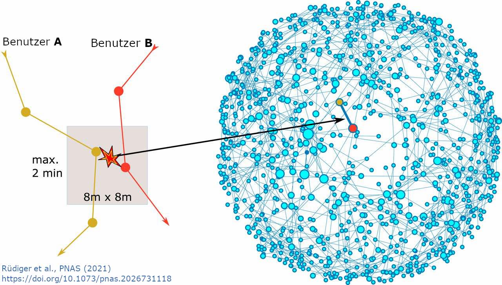

+++

widget = "blank" 
headless = false  # This file represents a page section.
active = true  # Activate this widget? true/false
weight = 10  # Order that this section will appear.
slug = "data-info/contacts"

title= ""

[design.background]
# Apply a background color, gradient, or image.
#   Uncomment (by removing `#`) an option to apply it.
#   Choose a light or dark text color by setting `text_color_light`.
#   Any HTML color name or Hex value is valid.

# Background color.
# color = "navy"

# Background gradient.
# gradient_start = "#4bb4e3"
# gradient_end = "#2b94c3"

# Background image.
# image = "rki-pic.jpeg"  # Name of image in `static/media/`.
# image_darken = 0.6  # Darken the image? Range 0-1 where 0 is transparent and 1 is opaque.
# image_size = "cover"  #  Options are `cover` (default), `contain`, or `actual` size.
# image_position = "center"  # Options include `left`, `center` (default), or `right`.
# image_parallax = true  # Use a fun parallax-like fixed background effect? true/false

# Text color (true=light or false=dark).
# text_color_light = true

+++

# Kontakte und die Pandemie





Wie sich eine Pandemie entwickelt, hängt von vielen Faktoren ab: von der Biologie des Erregers, von seiner Anfälligkeit für äußere Einflüsse wie Feuchtigkeit und Temperatur, vom Erfolg von Impfkampagnen, aber vor allem davon, wie wir miteinander in Kontakt treten: **Übertragungen finden for allem statt, wenn Menschen miteinander Kontakt haben.**

Die Anzahl an Kontakten gibt uns einen Einblick in das Infektionsgeschehen. Weniger Kontakte erschweren es dem Erreger, sich in der Bevölkerung auszubreiten, wohingegen mehr Kontakte eine schnelle Ausbreitung begünstigen.

Im [Kontakte-Monitor](/de/contact-index) zeigen wir die Anzahl an Kontakten in Deutschland im Zeitverlauf. Im Folgenden erklären wir, wie diese Kontakte aus den GPS-Daten von Mobiltelefonen gemessen werden.

Die Daten die im Monitor gezeigt werden sind [hier](https://rocs.hu-berlin.de/viz/contactindex-monitor/contactindex-data/data/) online verfügbar.

## Welche Daten werden untersucht?

Die Analysen hier beruhen auf GPS-Trajektorien von in Deutschland lebenden Personen. Was wir jedoch von unserem Kooperationspartner erhalten, ist nur die **durchschnittliche Anzahl der Kontakte pro Tag** sowie deren **Varianz** (im Abschnitt "Was ist ein Kontakt?" unten erklären wir, wie diese Beobachtungsgrößen mit GPS-Trajektorien zusammenhängen). Wir haben **keinen Zugang zu den GPS-Standortdaten**, auf deren Grundlage diese Maße berechnet werden.

Die GPS-Standortdaten werden von dem deutschen Unternehmen [NET CHECK](https://www.netcheck.de/) mit Hilfe von Mobiltelefonen gesammelt. Diese Art von Daten sind [kommerziell verfügbar](https://datarade.ai/data-categories/gps-location-data). Sie werden beispielsweise verwendet von öffentlichen Verkehrsbetrieben oder von Mobilfunknetzbetreibern zur Verbesserung der Netzabdeckung.

Die GPS-Daten werden von den einzelnen Geräten über ein Software Development Kit (SDK) übertragen. Dieses SDK dient in erster Linie dazu, die Qualität von Mobilfunknetzen zu bewerten. Es ist mit dem Einverständnis zur Datenerhebung auf rund **1,2 Millionen Geräten** in Deutschland installiert. Dabei sendet jedes Gerät bis zu **mehreren hundert Standorte** pro Tag. Von all diesen Geräten sind täglich etwa **600.000 aktiv**.

Die Daten enthalten **keine persönlichen Informationen** wie Alter oder Geschlecht und, was am wichtigsten ist, alle **Nutzer haben einer Datenerhebung zugestimmt** (durch Opt-in gemäß den [Nutzungsbedingungen](https://www.netcheck.de/datenschutz/) der SDK). Die gesamte Verarbeitung der rohen GPS-Daten erfolgt bei NET CHECK, wir erhalten nur regelmäßige Aktualisierungen für die hier gezeigten Größen (durchschnittliche Kontakte).

## Was ist ein Kontakt (und ein Kontakt-Netzwerk)?





Jeder GPS-Standort wird einem **Bereich (“Kachel”) von 8x8 Quadratmetern** zugewiesen. Wenn sich zwei Geräte **innerhalb von 2 Minuten auf derselben Kachel befinden**, wird dieses Ereignis als **Kontakt** zwischen den beiden Geräten definiert. Wenn sich zwei Geräte mehrmals treffen (z. B. wenn sich ein Paar sowohl morgens als auch abends zu Hause trifft), wird der Kontakt trotzdem nur einmal gezählt. Die Kontakte werden auch nicht danach gewichtet, wie viel Zeit die Personen in der Nähe des anderen verbracht haben.

Jeder Kontakt kann als eine **Verbindung** zwischen zwei Geräten in einem Netzwerk betrachtet werden. NET CHECK aggregiert diese Kontakte und erstellt so für jeden Tag ein **Kontaktnetzwerk**. In dem Netzwerk sind alle Geräte miteinander verbunden, die an diesem Tag einen Kontakt hatten (wobei wir davon ausgehen, dass jedes Gerät einer Person entspricht).

## Wie berechnen wir die mittlere Anzahl von Kontakten?





Die Anzahl der Kontakte zwischen Menschen beeinflusst die Ausbreitung einer Epidemie. Die gemessenen Kontakte geben uns darum einen **Einblick in das Infektionsgeschehen**.

Die **mittlere Anzahl der Kontakte** gibt an, wie viele andere Menschen im Mittel von einer einzigen infizierten Person potentiell angesteckt werden können.

Die Standardabweichung der Anzahl der Kontakte misst, **wie stark die Kontakte variieren**. Eine starke Variation bedeutet, dass es Personen mit einer großen Anzahl von Kontakten gibt, die zu **"Super-Spreader"-Ereignissen** führen könnten.

Es ist zu beachten, dass die Verteilung der Anzahl der Kontakte eine untere Grenze bei Null hat. Das bedeutet, dass eine Person viel mehr Kontakte haben kann als die durchschnittliche Anzahl der Kontakte, aber nicht viel weniger (siehe vereinfachte Verteilung oben). Eine starke Streuung bedeutet also, dass Personen mit mehr Kontakten als der Durchschnitt häufiger sind, und nicht umgekehrt (=Personen mit weniger Kontakten als der Durchschnitt sind häufiger).

Das Kontaktnetzwerk das wir hier messen ist natürlich nur eine Stichprobe. Nicht jede Person in Deutschland ist in den Daten abgebildet, und das gemessene Netzwerk darum nur ein kleiner Ausschnitt aus dem vollständigen Netzwerk. Wir nutzen aber Konzepte aus der Netzwerktheorie, um aus der Stichprobe den Mittelwert und die Varianz der Kontakte des vollständigen unbekannten Kontaktnetzwerks abzuleiten. Details dazu sind in folgender Publikation enthalten: [Rüdiger et al.](https://www.pnas.org/content/118/31/e2026731118).
