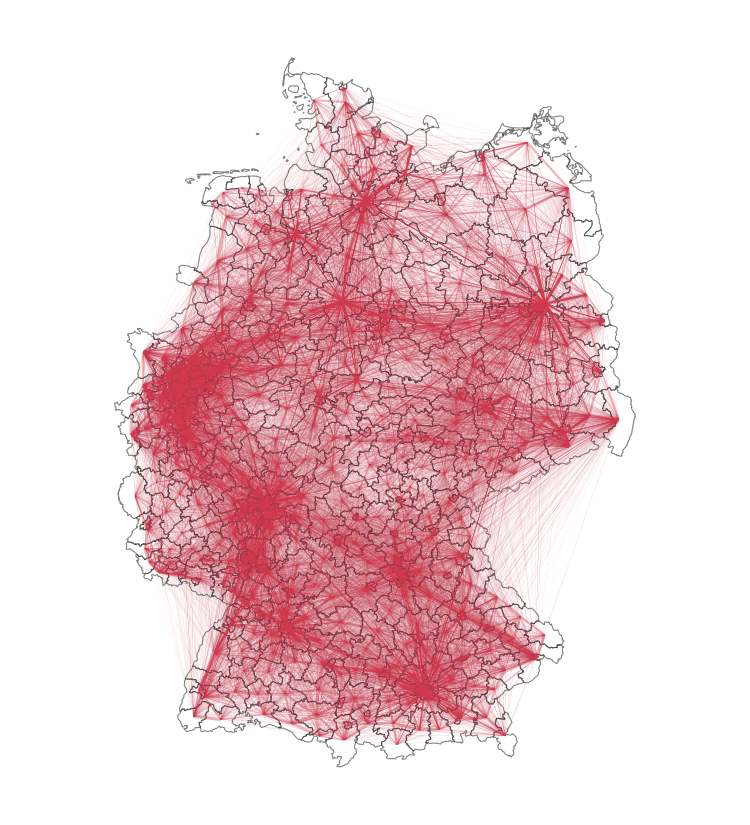

+++

widget = "blank"  # See https://sourcethemes.com/academic/docs/page-builder/
headless = true  # This file represents a page section.
active = true  # Activate this widget? true/false
weight = 20  # Order that this section will appear.
slug = "data-info"

title= "Methoden und Daten"

[design.background]
# Apply a background color, gradient, or image.
#   Uncomment (by removing `#`) an option to apply it.
#   Choose a light or dark text color by setting `text_color_light`.
#   Any HTML color name or Hex value is valid.

# Background color.
# color = "navy"

# Background gradient.
# gradient_start = "#4bb4e3"
# gradient_end = "#2b94c3"

# Background image.
# image = "rki-pic.jpeg"  # Name of image in `static/media/`.
# image_darken = 0.6  # Darken the image? Range 0-1 where 0 is transparent and 1 is opaque.
# image_size = "cover"  #  Options are `cover` (default), `contain`, or `actual` size.
# image_position = "center"  # Options include `left`, `center` (default), or `right`.
# image_parallax = true  # Use a fun parallax-like fixed background effect? true/false

# Text color (true=light or false=dark).
# text_color_light = true

+++

# Welche Daten untersuchen wir?





Wir analysieren **Bewegungsströme** in Deutschland, die auf Basis von Mobilfunkdaten erhoben wurden. Unsere Daten enthalten die Bewegungen, die zwischen Gebieten stattfinden. Ein Rückschluss auf die Bewegung einzelner Personen ist dabei nicht möglich. Bei den Gebieten arbeiten wir auf der räumlichen Ebene von Landkreisen.

Die Daten umfassen nur die **Anzahl an Bewegungen** zwischen und innerhalb von Gebieten. Eine Bewegung kann im gleichen Gebiet starten und enden, allerdings sehen wir nicht _wo_ innerhalb der Gebiete die Bewegung stattfand. Alle Bewegungen in einem Zeitraum werden zusammengefasst, beispielsweise tagesweise.

In diesen aggregierten Zahlen lassen sich keine einzelnen Nutzer identifizieren. Die Daten umfassen auch **keinerlei personenbezogenen Informationen** wie Alter oder Geschlecht, auch nicht als aggregierte Statistiken.

# Woher kommen die Daten?

Bewegungsströme dieser Art werden von vielen Mobilfunkanbietern erfasst. Wir nutzen Daten der Telekom, die von der Firma [T-Systems](https://www.t-systems.com/de/de) vertrieben werden, sowie Daten der Telefónica, die von der Firma [Teralytics](https://www.teralytics.net/) vertrieben werden. Diese Daten sind gewerblich erhältlich und werden von zahlreichen Unternehmen verwendet, beispielsweise von Transportunternehmen, zur Verkehrsplanung oder zur Analyse von Verkehrsinfrastruktur.

Der Mobilfunkanbieter registriert, welche Geräte mit seinen Funkmasten verbunden sind. Diese Roh-Daten werden zu Bewegungsströmen aggregiert. Die personenbezogenen Daten werden dabei strikt von den Geo-Daten getrennt und bereits vor der Auswertung entfernt. Anonymität steht hier an erster Stelle. Bei T-Systems wurde das Anonymisierungsverfahren in enger Abstimmung mit dem Bundesbeauftragten für Datenschutz und Informationsfreiheit ([BfDI](https://www.bfdi.bund.de/DE/Home/home_node.html)) entwickelt. Bei Telefónica ist Basis für das Bereitstellen dieser Informationen die Datenanonymisierungsplattform DAP, die in enger Zusammenarbeit mit dem Bundesdatenschutzbeauftragten entwickelt wurde (siehe weiterführende [Informationen zum Anonymisierungsverfahren von Telefónica](https://www.telefonica.de/dap.html)).

# Was bedeutet eine Bewegung?

Eine Bewegung wird vom Mobilfunkanbieter erkannt, wenn sich eine Person zwischen Funkzellen bewegt hat und wieder stationär wird. Start- und Endzelle können dabei auch übereinstimmen.

Die Bewegung wird dann dem entsprechenden räumlichen Aggregations-Gebiet zugeordnet, beispielsweise dem Landkreis, und mit allen Bewegungen im Zeitraum zusammengezählt. Falls die Gesamtzahl an Bewegungen zwischen zwei Gebieten unter einer bestimmten Schwelle liegt werden diese nicht in die Daten aufgenommen, um die Anonymität von Individuen sicherzustellen.

# Wie berechnen wir die Änderung der Mobilität?

In unseren Analysen und dem Dashboard zeigen wir die Abweichung der Mobilität von der "normalen" Mobiliät. Dazu zählen wir die Anzahl der Bewegungen, und vergleichen sie mit der erwarteten Anzahl an einem normalen Vergleichszeitraum.

Als Vergleichszeitraum für dem März 2020 verwenden wir die Anzahl an Bewegungen in einer Durchschnittswoche aus dem März 2019. Wenn wir einzelne Tage vergleichen berechnen wir immer die Abweichung zu dem entsprechenden Wochentag aus der Durchschnittswoche. **Update:** Die Werte im Mobility Monitor und in den aktuellen Plot beziehen sich mittlerweile nicht nur auf März 2019, sondern auf den jeweils aktuellen Monat aus 2019. Mehr Details dazu [hier]().

Mathematisch gesprochen: Wenn wir annehmen dass \\(N_i^{(t)}\\) die Anzahl an Bewegungen in einem Gebiet \\(i\\) im Zeitraum \\(t\\) ist, und \\(t^\*\\) ein geeigneter Vergleichszeitraum mit normaler Mobilität ist, dann berechnet sich die Änderung der Mobilität \\(\Delta n\\) als:

\\[\Delta n=(N_i^{(t)} / N_i^{(t^\*)})-1\\]




