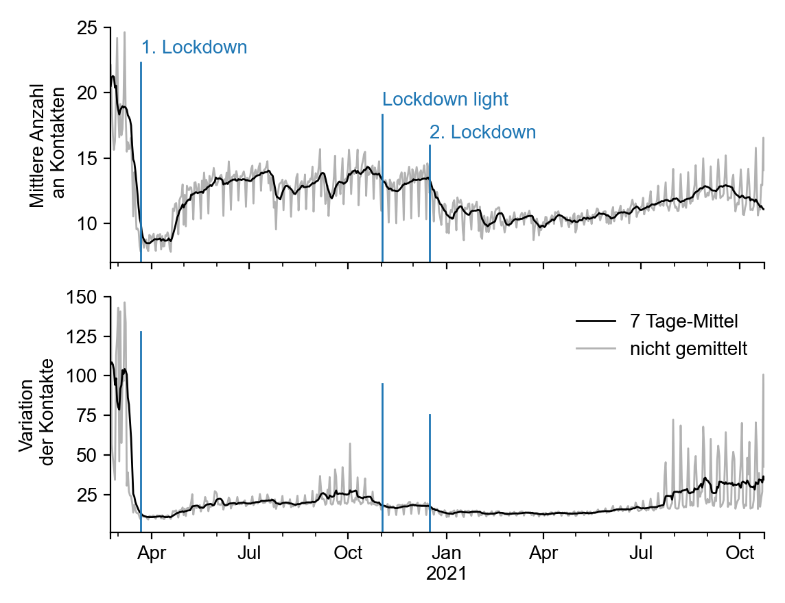
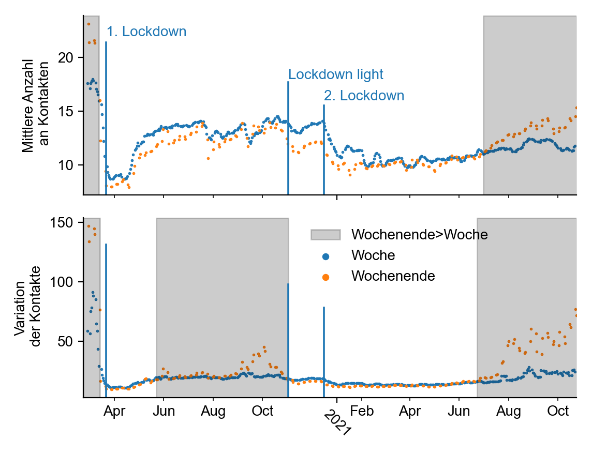

+++
date = "2021-11-03"
title = "Unser Kontaktverhalten in der Pandemie"
slug = "contacts-pandemic"
draft = false
authors = ["pascal", "frank"]
+++

In der Pandemie wurden wir oft dazu angehalten, unsere Kontakte zu reduzieren. Covid-19 breitet sich schließlich vor allem aus, wenn Menschen sich treffen. Wir alle wissen, wie wir uns persönlich, im eigenen Umfeld eingeschränkt haben.

Aber wie hat sich das **Kontaktverhalten in der ganzen Bevölkerung** verändert? Unsere persönlichen Erfahrungen sind schließlich nur Ausschnitte des Gesamtbildes und so ist es aufschlussreich, rückblickend ein objektives Maß unseres Kontaktverhaltens zu betrachten.

Wir stellen seit Kurzem die mittleren Kontakte und die Variation derselben in unserem [Kontakt-Monitor]() dar (wöchentlich aktualisiert). Diese Werte basieren auf den GPS-Daten von täglich ca. 600 000 Mobiltelefonen, wobei ein Kontakt gezählt wird, sobald 2 Geräte zur gleichen Zeit am gleichen Ort sind (Entfernung von ca. 8 Meter). Uns steht nur die anonymisierte Statistik zur Verfügung (siehe [Methodik]()).

## Kontakte im Pandemieverlauf

Im ersten Lockdown (22.03.2020) sehen wir einen **starken Einbruch der mittleren Anzahl an Kontakten um rund die Hälfte im Vergleich zum Vor-Pandemie Niveau** (von ca. 19 auf 9 Kontakte pro Mensch pro Tag). Die Kontakte sinken auch bereits vor dem harten Lockdown, da einzelne Länder schon früh Maßnahmen beschlossen hatten (z. B. Schulschließungen am 16.03.2020) und Einzelpersonen individuell mit Kontakteinschränkungen reagierten.





Nach dem ersten Lockdown, im Sommer 2020, erholten sich die Kontakte wieder, aber erreichten nie wieder das Vor-Pandemie-Niveau.

Der **Lockdown light** (ab 02.11.2020) sorgte nach der Erholung im Sommer nochmal für einen Einschnitt, und drückte die mittleren Kontakte auf etwa **-30%** unter das Vor-Pandemie Niveau. Allerdings war diese Reduktion deutlich schwächer als beim ersten Lockdown, und nach 2 Wochen stiegen die Zahlen schon wieder an.

Erst der **zweite Lockdown** (16.12.2020) reduzierte unser mittleres Kontaktverhalten langanhaltend auf etwa 10 tägliche Kontakte bis Juli 2021, was wieder etwa -50% unter dem Vor-Pandemie Niveau lag.

**In den letzten Monaten** (Juli bis September 2021) befanden wir uns im Aufwärtstrend, in dem die Kontakte über mehrere Monate hinweg stetig zunahmen. **Aktuell** beobachten wir eine leichte Abnahme der Kontakte, was an dem erneuten Anstieg der Inzidenz liegen könnte oder auch am bevorstehenden Winter.

## Variation der Kontakte und Gruppengröße

Nach diesen Beobachtungen könnte man annehmen, dass der **Lockdown light** nur schwache Auswirkungen auf unser Verhalten hatte. Abgesehen von der mittleren Anzahl an Kontakten ist es aber auch wichtig, die **Variation der Kontakte** zu betrachten. Diese ist größer, je mehr Menschen sich in **großen Gruppen** treffen, die besonders zur Ausbreitung beitragen können.





Wenn wir uns die **Variation der Kontakte** anschauen (erste Grafik), fällt auf, dass es ab dem Lockdown light **keine starken Ausschläge in der Variation der Kontakte** mehr gab. Diese Ausschläge (Spitzen) fallen auf die Wochenenden, da dort gehäuft größere Veranstaltungen stattfinden, welche die Variation der Kontakte in die Höhe treiben (siehe [Methodik]()).

Somit hat der Lockdown light **sehr effektiv größere Veranstaltungen unterbunden**.

## Kontakte im Alltag und in der Freizeit

Ein interessantens Muster sehen wir, wenn wir die Kontakte am Wochenende mit denen unter der Woche vergleichen. Man kann davon ausgehen, dass am Wochenende vor allem Freizeit-Kontakte stattfinden, während unter der Woche die meisten Kontakte Alltags- oder Arbeits-Kontakte sind.

Vor der Pandemie hatten wir durchschnittlich **mehr Kontakte an Wochenenden** als unter der Woche. Mit dem ersten Lockdown hat es sich **umgekehrt: Während dem Lockdown gibt es mehr Kontakte unter der Woche als am Wochenende**. Diese Abkehr von der Normalität dauerte über ein Jahr an, bis Juni 2021.

Das könnte daran liegen, dass sich unser Sozialleben während der Pandemie auf **Arbeits- und Alltags-Kontakte** reduziert hat während **private Kontakte**, die wir vermehrt an Wochenenden pflegen, **durchgängig stärker reduziert wurden**.

**Seit Juli 2021** beobachten wir aber einen stetigen **Anstieg der Kontakte an Wochenenden**, die mittlerweile so hoch sind wie sonst noch nie im Pandemiverlauf. Das spricht dafür, dass sich Menschen wieder verstärkt in ihrer Freizeit treffen.





Auch die **Variation der Kontakte** (ein Indiz für größere Veranstaltungen) war **vor der Pandemie am Wochenende höher**. Das macht Sinn, da größere Versammlungen vor allem am Wochenende stattfanden.

Während dem ersten Lockdown kehrte sich das Verhältnis aber um, und die Variation der Kontakte war am Wochenende etwas geringer als unter der Woche. Erst im Oktober 2020 stieg die Variation am Wochenende wieder an. Das heißt, es ist davon auszugehen, dass in dieser Zeit Versammlungen am Wochenende zwar wieder etwas größer waren, aber deutlich kleiner als vorpandemische Großveranstaltungen.

**Nach dem Lockdown light** fiel die Variation der Kontakte am Wochende wieder deutlich ab und blieb seitdem niedriger als das Niveau unter der Woche, was vermuten lässt, dass private Wochenendveranstaltungen kleiner sind als Versammlungen unter der Woche.

Allerdings beobachten wir **seit Juli 2021** einen **starken Anstieg der Variation der Kontakte** am Wochenende, parallel zu dem oben beschriebenen Anstieg der mittleren Kontaktzahl. Das spricht dafür, dass sich wieder deutlich mehr Menschen in großen Gruppen am Wochenende treffen, auf einem höheren Niveau als zu jedem anderen Zeitpunkt der Pandemie.

## Fazit

Wie unsere Daten zeigen, ist das Kontaktverhalten noch immer nachhaltig durch die Pandemie verändert: Menschen treffen sich insgesamt weniger, in weniger großen Gruppen.

Allerdings beobachten wir in den letzten Monaten (seit etwa Juli 2021) einen Anstieg der Kontakte, mit einem deutlichen Anstieg der Kontakte an Wochenende, was dafür spricht dass sich Menschen wieder verstärkt in der Freizeit und in größeren Gruppen treffen als sonst während der Pandemie.

Es wird spannend zu beobachten wie sich die Kontakte weiter entwickeln. Die wöchentlich aktuellen Zahlen sind in unserem [Kontakt-Monitor]() zu sehen.
