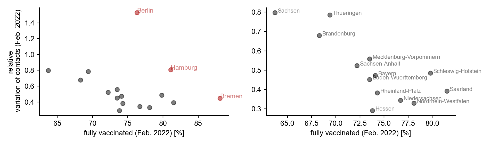

+++
date = "2021-12-09"
title = "Kontakt-Monitor Update: jetzt für Bundesländer"
slug = "contacts-states-feb2022"
draft = false
authors = ["pascal"]
+++

Seit heute (01.03.2022) ist es möglich, das Kontaktverhalten in den einzelnen Bundesländern in unserem [Kontakt-Monitor]() zu beobachten. Es gibt täglich Updates, wobei es einige Tage dauert, bis genügend Nutzerdaten eingetroffen sind, um die Kontaktmaße zu berechnen.
Die Anzahl der mittleren Kontakte, sowie die Variation der Kontakte (Standardabweichung) werden mit derselben Methodik berechnet wie auch die bundesweiten Kontaktdaten: ein Kontakt zwischen 2 Geräten wird registriert, sobald beide zur selben Zeit am selben Ort sind. Dabei wird die Zeit in 2 Minuten Abschnitte und der Raum in 8 x 8 Quadratmeter Kacheln aufgeteilt (siehe [Methodik]()). 

## Bundesländervergleich über die relative Variation der Kontakte 

In einem vorhergehenden [Bericht]() haben wir bereits das Kontaktverhalten der einzelnen Bundesländer untersucht. Dabei stellten wir fest, dass die absoluten Werte der mittleren Zahl der Kontakte und der Variation der Kontakte stark von der Bevölkerungsdichte des jeweiligen Bundeslandes abhängen. Somit ist zu beachten, dass ein direkter Vergleich der Maße nur möglich ist zwischen Ländern mit ähnlicher Bevölkerungsdichte.

Wir können die Kontaktmaße jedoch vergleichbar machen, wenn wir sie relativ zu vorhergehenden Extrema betrachten: Nehmen wir z.B. Schleswig-Holstein und deren Variation der Kontakte (ein Schätzer für die Gruppengrößen, siehe [Methodik]()). Zunächst können wir das Monatsmittel berechnen, um weniger Rauschen in den Daten zu haben. Nachdem wir das maximale und minimale Monatsmittel im Jahr 2021 ermittelt haben, bestimmen wir das aktuellste Monatsmittel (Februar 2022) relativ zu diesen Extrema. Für Schleswig-Holstein beträgt der Wert etwa ½ (siehe unteren Grafik).





Die relativen Veränderungen der Kontakte sind wie folgt zu lesen: Hat Berlin beispielsweise einen relativen Wert von 1, so entspricht das Monatsmittel dem Maximum in 2021. Ein relativer Wert von 0,5 bedeutet, dass der aktuelle Monatsmittelwert auf halbem Weg zwischen den Minima und Maxima von 2021 liegt. Ein relativer Wert von 0 bedeutet, dass die Variation der Kontakte in Berlin genauso niedrig ist wie das Minimum in 2021.

Da wir uns im Februar 2022 voll in der Omikron Welle befanden, mit davor nie gesehenen Inzidenzen, sollte eine Bevölkerung, die sensitiv auf das Infektionsgeschehen reagiert, große Gruppenversammlungen vermeiden (Erinnerung: die Variation der Kontakte ist ein Schätzer für Gruppengrößen). Außerdem sollte eine sensitive Bevölkerung eine hohe Impfrate haben (um die Pandemie generell einzudämmen). So erwarten wir, dass Länder mit einer hohen Impfrate eine niedrige relative Variation der Kontakte haben.





Interessanterweise scheinen die Stadtstaaten (rot hervorgehoben) besonders hohe Werte zu haben, verglichen mit Staaten  mit ähnlicher Impfrate. Wenn wir jedoch die Gruppe der Stadtstaaten und der restlichen Staaten getrennt betrachten, bestätigt sich die erwartete Abhängigkeit der relativen Variation der Kontakte von der Impfrate. Dabei sind die sehr hohen Werte in Berlin teilweise mit der im Februar stattfindenden Berlinale zu erklären.

Diese Ergebnisse deuten darauf hin, dass die Bevölkerung in Staaten mit einer höheren Impfrate ihre Kontakte in Zeiten hoher Inzidenz stärker reduziert (genauer gesagt: die Gruppengrößen sind dort geringer).
