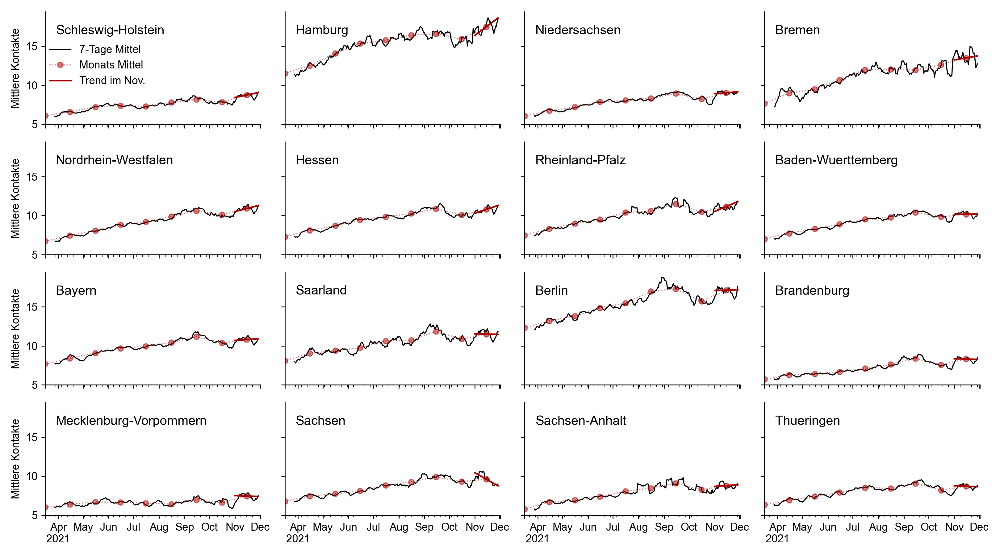
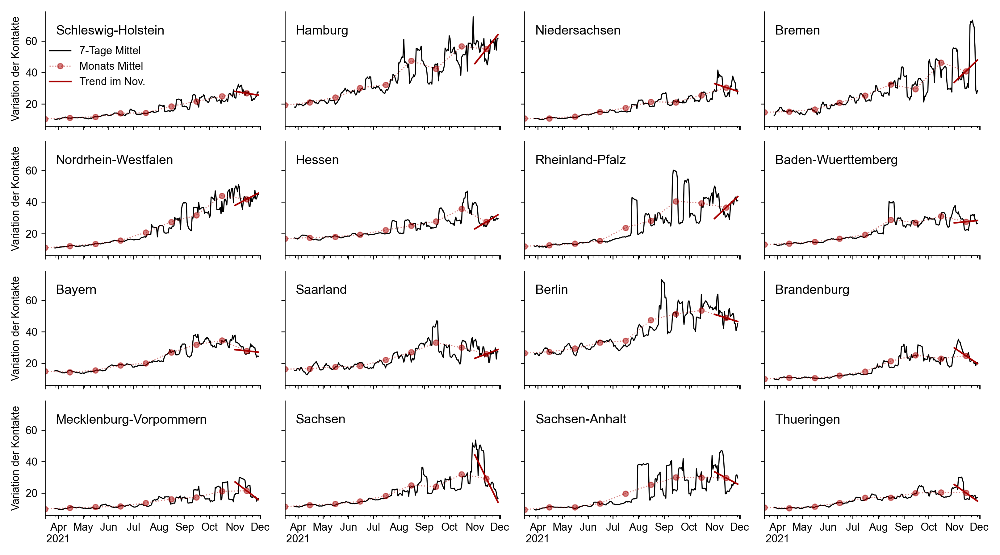
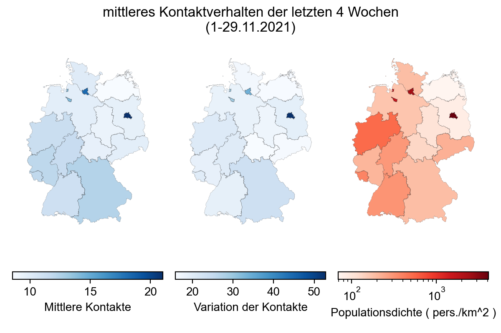
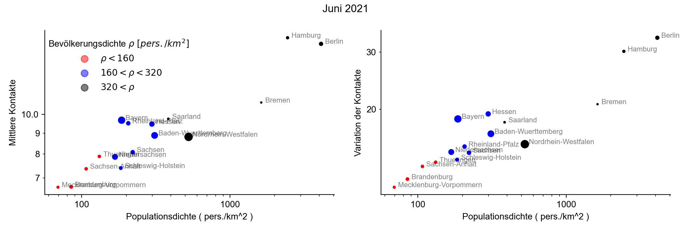
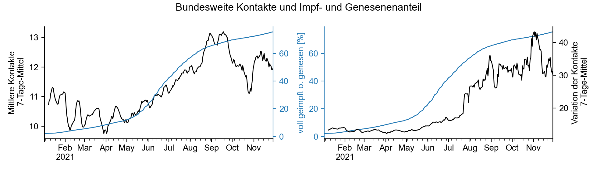
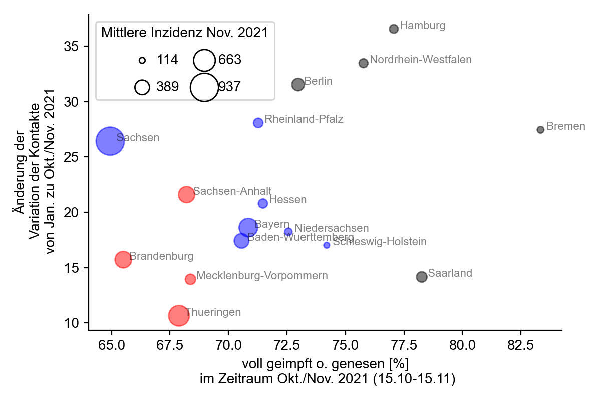

+++
date = "2021-12-09"
title = "Bundesland aufgelöstes Kontaktverhalten"
slug = "contacts-states-nov2021"
draft = false
authors = ["pascal"]
+++

Auf unserem [Kontakt-Monitor]() können wir die mittleren Kontakte und die Variation der Kontakte auf Bundesebene verfolgen. Hier wollen wir uns mit Kontaktänderungen der einzelnen Bundesländer auseinandersetzen. Dabei fokussieren wir uns auf die jüngsten Entwicklungen des letzten Monats November 2021, da zu dieser Zeit einen massiven Anstieg der Fallzahlen verzeichnet wurde.

Generell beobachten wir ein ähnliches Kontaktverhalten wie bereits auf Bundesebene bekannt: die **mittleren Kontakte** steigen seit April stetig an. In allen Bundesländern stiegen die mittleren Kontakte im November im Vergleich zum Oktober an. **Innerhalb des Monats November** (Trend im November) stiegen oder stagnierten die mittleren Kontakte in allen Bundesländern, mit **Ausnahme von Sachsen**, wo es einen **deutlichen Abwärtstrend** gibt.





Die **Variation der Kontakte** ist jedoch wichtiger für das Pandemiegeschehen, da sie ein Schätzer für Versammlungsgrößen ist: Wenn die täglichen Kontakte zwischen Personen stark variieren, liegt es hauptsächlich an Personen mit besonders vielen Kontakten, deren große Kontaktzahl vermutlich nur während einer Veranstaltung erreicht werden kann (siehe [Methodik]()).

Die Bundesländer unterscheiden sich stärker in der Variation der Kontakte. So ist die **Variation im November** nur in **Schleswig-Holstein und Niedersachsen deutlich angestiegen**, in den meisten Bundesländern ist sie vergleichbar mit Oktober außer in **Hessen, Bayern, Saarland, Berlin und Sachsen wo sie deutlich fällt**.

**Innerhalb des Monats November** (Trend im November) gibt es einen Anstieg in den meisten alten Bundesländern (Ausnahmen: Schleswig-Holstein, Niedersachsen, Bayern). **In allen neuen Bundesländern fällt die Variation der Kontakte im November**. Besonders hervorzuheben ist hier **Sachsen mit dem stärksten Abfall der Kontakte**. Der starke Trend in Sachsen und dass Bayern eine Ausnahme zu den alten Bundesländern darstellt, liegt vermutlich an der hohen Inzidenz in diesen Ländern und dass Politik und Einzelpersonen darauf reagieren. 





## Räumliche Verteilung der Kontakte und der Zusammenhang mit der Bevölkerungsdichte

Wenn wir das Kontaktverhalten der letzten 4 Wochen nach Bundesland aufgelöst betrachten, sehen wir ein Nord-Süd-Gefälle sowohl der mittleren Kontakte, als auch der Variation der Kontakte. Ausgenommen sind die Stadtstaaten, welche das stärkste Kontaktverhalten zeigen.  Die Stadtstaaten haben auch die höchsten Bevölkerungsdichten und ein direkter Vergleich legt nahe, dass **dichter besiedelte Regionen zu mehr Kontakten und einer stärkeren Variation der Kontakte** führen.





Ein Kontakt zwischen zwei Mobiltelefonen wird erfasst, wenn diese zur selben Zeit etwa 8 Meter voneinander entfernt sind (siehe Methoden). Also werden damit auch **risikoarme Kontakte** registriert, bei denen Krankheitserreger nicht übertragen werden können, wenn z.B. der Kontakt im Freien stattfindet. **Steigt die Populationsdichte werden risikoarmen Kontakte öfter erfasst**, was aber nicht das Infektionsgeschehen beeinflussen sollte.





Wir teilen deshalb die Bundesstaaten in 3 Gruppen: eine Gruppe mit geringer (weniger als 160 Personen je km^2 ), mittlerer (zwischen 160 und 320 Personen je km^2 ) und eine mit hoher Bevölkerungsdichte (mehr als 320 Personen je km^2) welche wir im folgenden mit rot, blau und schwarz farblich kennzeichnen werden. Ein Vergleich der Bundesländer innerhalb der jeweiligen Gruppe ist somit fairer.

## Die Änderung der Kontakte und des Anteils Geimpft/Genesener
 
Seit Anfang des Jahres 2021 wurden zunehmend mehr Menschen geimpft. Somit nahm der Anteil der Bevölkerung zu, bei dem die Wahrscheinlichkeit an Covid-19 zu erkranken um etwa 70% und die Krankheit zu übertragen um etwa 50% reduziert ist. Ähnliches gilt für Genese, weshalb für beide Gruppen Kontakte weniger Risiko mit sich bringen.

So beobachten wir, dass mit einem höheren Anteil an Geimpften oder Genesenen sich die mittlere Anzahl der Kontakte ebenfalls erhöht. Für die Variation der Kontakte gilt ähnliches, jedoch wird ihr Anstieg ab 50% Geimpft/Genesenen stärker. Da die Variation der Kontakte eine Approximation für Gruppengrößen ist, scheinen sich **Versammlungen stärker mit dem Anteil der Geimpften zu vergrößern, wenn der Anteil der geimpft/genesenen Bevölkerung überwiegt**.

Hierbei ist zu beachten, dass die Änderung der Kontakte nicht nur auf den Anstieg des Impf- und Genesenenanteil zurückzuführen ist. Generell ist davon auszugehen, dass wir mit der Zeit langsam wieder mehr Kontakte aufbauen und uns dem vor-pandemischen “Normalzustand” annähern.





## Das Zusammenwirken von Impfrate und Kontaktänderungen  auf die Inzidenz

Für das Infektionsgeschehen ist die Variation der Kontakte ausschlaggend, was in der Studie von [Rüdiger et al.](https://www.pnas.org/content/118/31/e2026731118) mit dem Kontaktindex gezeigt werden konnte, der sehr stark mit der Variation der Kontakte im Zusammenhang steht (die Studie beruht auf denselben Daten). Dabei konnte gezeigt werden, dass der momentane Kontaktindex das Infektionsgeschehen in etwa 2 Wochen beschreibt. Somit sollte die mittlere Variation der Kontakte von Mitte Oktober bis Mitte November die Inzidenz von November 2021 beschreiben. Jedoch ist auch der Anteil an Geimpft/Genesenen wichtig und wir erwarten, dass die Bundesländer mit einem höheren Anteil eine geringere Inzidenz haben.





Wenn wir diese 3 Gesichtspunkte (Kontakte, Impf-/Genesenenanteil, Inzidenz) zusammen betrachten und die Bundesländer mit ähnlicher Bevölkerungsdichte untereinander vergleichen (gleiche Farben), fällt auf, dass in **Sachsen die Variation der Kontakte seit Januar stark gestiegen** ist, jedoch im Vergleich zu den anderen Bundesländern ähnlicher Bevölkerungsdichte **den geringste Anteil von Geimpft/Genesenen hat**. Dies könnte gut erklären, weshalb Sachsen die höchste mittlere Inzidenz aller Bundesländer im November 2021 hat.

Außerdem fällt auf, dass die **Bundesländer mit der geringsten Bevölkerungsdichte auch den geringsten Anteil von Geimpft/Genesenen haben** (mit Ausnahme von Sachsen), und die mit der größten Bevölkerungsdichte den höchsten Anteil. Es könnte sein, dass Menschen in dichter besiedelten Regionen im Alltag mehr Rücksicht aufeinander nehmen müssen und somit ist auch die Einsicht leichter zugänglich, dass man auch andere durch die eigene Impfung schützt. 

Ein letzter Punkt bleibt bei dieser Grafik zu erwähnen: Die neuen Bundesländer haben in der jeweiligen Bevölkerungsgruppe den geringsten Anteil an Geimpft/Genesenen, also Berlin in der Gruppe der dicht bevölkerten Länder und Sachsen in der mittleren Gruppe. Die Gruppe der geringsten Bevölkerungsdichte besteht ausschließlich aus neuen Bundesländern.
