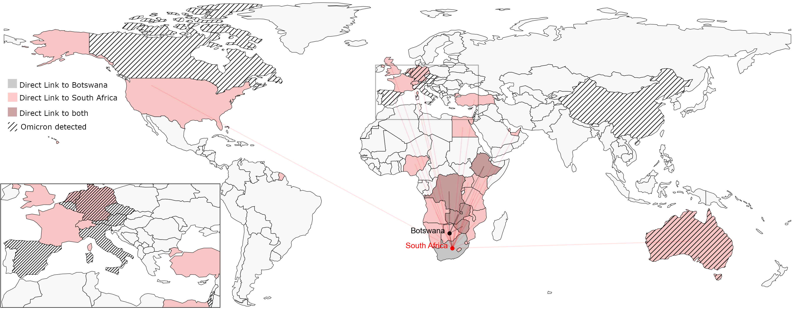

+++
title = "Omicron - Import Risiko"
slug = "importrisk_omicron"
date = "2021-11-29"
authors = ["adrian", "pascal", "frank", "benjamin", "dirk"]
+++

Omicron, die neue besorgniserregende Variante, wurde erstmals im November 2021 in Südafrika und Botswana entdeckt. Bis zum Datum dieses Berichts (30.11.2021) wurde sie laut GISAID in **11 weiteren Ländern gemeldet: Kanada, Spanien, Belgien, Niederlande, Deutschland, Italien, Österreich, Tschechische Republik, Israel, Hongkong (China) und Australien.**

Einige Länder, wie z. B. Israel, haben bereits alle ankommenden Flüge aus Südafrika, Botswana und ihren Nachbarländern gestoppt. Viele der Länder, in denen Omicron entdeckt wurde, haben jedoch keine direkten Flugverbindungen nach Südafrika oder Botswana, wie etwa Hongkong (China), Spanien oder Kanada. Dies liegt an den Umsteigeverbindungen, und es ist daher nicht einfach abzuschätzen, wie wahrscheinlich ein Land die neue Variante einführt.




_Highlighted are the 30 countries with direct flight connection to South Africa and Botswana (grey and red) and countries in which omicron was already detected (grey hatched, data up until 30.11.2021). The inset in the Pacific is a zoom on Europe. Note that countries with omicron reports do not necessarily have direct flight connections._

## Relatives Import Risiko

Wir schätzen die **Import Risiko Wahrscheinlichkeit** auf der Grundlage des weltweiten Luftverkehrsnetzes vom August 2021 (d. h. 3 Monate vorher).  Das weltweite Luftverkehrsnetz enthält die Anzahl der Passagiere auf allen Flugverbindungen rund um den Globus. Anhand dieser Passagierzahlen können wir abschätzen, wie wahrscheinlich es ist, dass sich das Virus in ein anderes Gebiet ausbreitet: Je verkehrsreicher eine Flugstrecke ist, desto wahrscheinlicher ist es, dass ein infizierter Passagier diese Strecke befliegt.





Wir haben jedoch nur Daten über _direkte_ Flugverbindungen. Wir wissen nicht, welche Reisenden Zwischenstopps einlegen oder mehrere Anschlussflüge nutzen, bevor sie an ihrem Zielort aussteigen. Dies müssen wir berücksichtigen, um zu verstehen, wie das Virus in Länder gelangt, die keine direkten Flugverbindungen nach Südafrika oder Botswana haben (mehr Details unter [Import Risiko Methoden]()).

Wir verwenden eine **probabilistische Methode**, um abzuschätzen, wie viele Reisende den Flughafen nach einem Flug verlassen und wie viele mehrere Anschlussflüge nutzen, um ihr Ziel zu erreichen (siehe [Import Risiko Methoden]()). Anhand dieser probabilistischen Konzepte berechnen wir das _relative Importrisiko_ für andere Flughäfen.

Das Importrisiko sagt uns, wie wahrscheinlich es ist, dass ein infizierter Passagier aus Südafrika oder Botswana in das jeweilige Land reist und den Flughafen dort verlässt. Ein Importrisiko von 0,9 % in Deutschland bedeutet zum Beispiel, dass von 1000 infizierten Personen voraussichtlich 9 Deutschland als Ziel haben werden.



Aktuelle Schätzungen des Einfuhrrisikos für die Omicron-Variante für die 50 Länder mit dem höchsten Einfuhrrisiko (außer Südafrika und Botsuana). **Fahren Sie mit dem Mauszeiger über ein Land**, um das relative Einfuhrrisiko der wichtigsten Flughäfen in dem ausgewählten Land anzuzeigen. Das nationale Einfuhrrisiko ist das kumulierte Einfuhrrisiko aller Flughäfen in diesem Land. Eine ausführlichere Erläuterung der Analyse finden Sie in den [Import Risiko Methoden]().



Die Länder mit dem höchsten Importrisiko sind vor allem afrikanische Länder (für einige von ihnen ist das tatsächliche Importrisiko sogar noch höher, da wir den Straßenverkehr nicht berücksichtigen). Die USA liegen ebenfalls weit vorne, gefolgt von vielen Ländern des Mittleren Ostens und Europas.
Unter den 50 Ländern mit dem höchsten Importrisiko befinden sich 7 der 11 Länder, in denen Omicron bisher gemeldet wurde. Nur China, Israel, die Tschechische Republik und die Niederlande sind nicht darunter.
Der Nachweis der Variante hängt jedoch auch davon ab, wie stark das jeweilige Land testet und wie viele der Testproben sequenziert werden. Außerdem basiert unsere Analyse auf dem Luftverkehrsnetz von vor drei Monaten, und während der Corona-Pandemie ändert sich das Netz monatlich stark (insbesondere internationale Verbindungen nach China). Und schließlich berücksichtigt unsere probabilistische Methode keine historischen Verbindungen zwischen Ländern. Wenn beispielsweise ein Passagier zum Drehkreuzflughafen Amsterdam Schiphol reist, geht unsere Methode davon aus, dass viele Reisende zu anderen Orten weiterreisen, aber aufgrund der historischen Verbindungen des Landes zu Südafrika könnten mehr Passagiere als geschätzt tatsächlich dort bleiben.

## Europäisches Import Risiko

Die nachstehenden Diagramme zeigen das Importrisiko für Europa, nicht nach Ländern, sondern nach Flughäfen.
Wir sehen, dass die großen Flughäfen wie London Heathrow und Paris Charles de Gaulle das höchste Risiko aufweisen. In Deutschland ist Frankfurt der am meisten gefährdete Flughafen, gefolgt von München und Berlin. Viele Ziele in Südeuropa und rund um das Mittelmeer rangieren sehr hoch, was zum Teil auf den hohen Anteil des Urlaubsverkehrs zum Zeitpunkt der Messung des Flughafennetzes (August 2021) zurückzuführen sein könnte.
Auch hier liegt der Flughafen Amsterdam nur an 13. Stelle, obwohl er der europäische Flughafen mit den meisten Fluggästen ist, die direkt aus Südafrika kommen (~16.000 im August 2021). Dies liegt daran, dass Amsterdam ein Drehkreuz ist und die Methode daher von vielen Anschlussflügen ausgeht.




