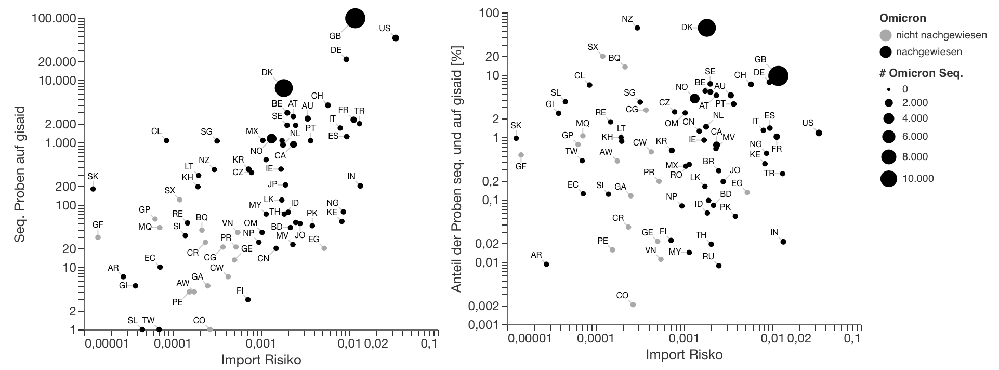
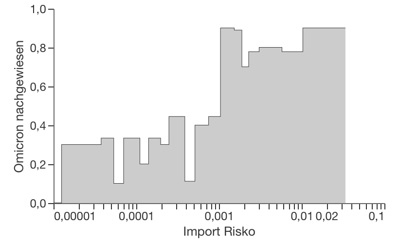
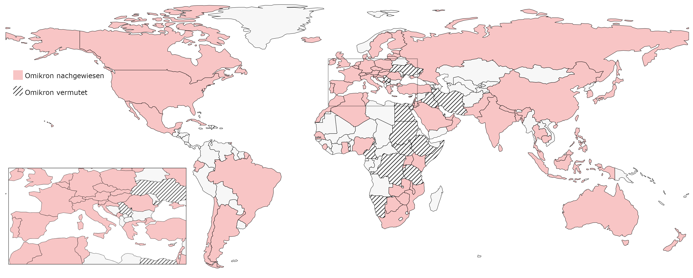
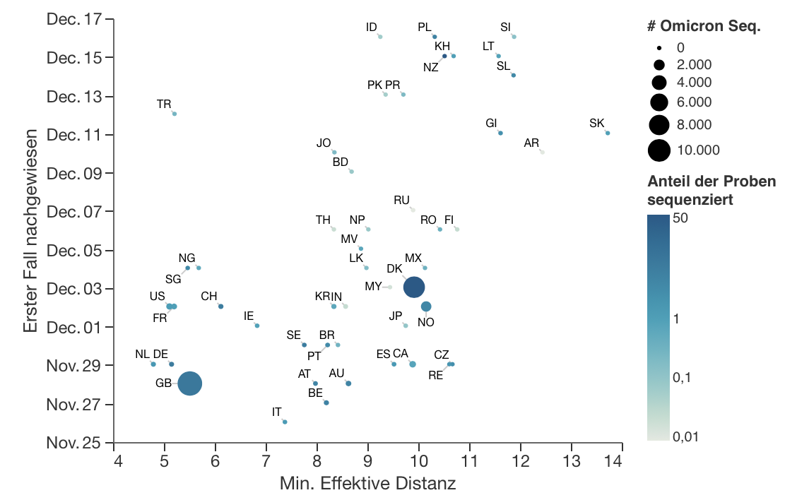

+++
title = "Update: Omikron - Import Risiko (evtl. betroffenen Länder)"
slug = "importrisk_omicron_update"
date = "2021-12-17"
authors = ["adrian", "pascal"]
+++

Hier aktualisieren und erweitern wir einen aktuellen [Bericht]() vom 29.11.2021 mit neuen Daten. Als der erste Omikron-Bericht geschrieben wurde, war Omikron in nur 11 Ländern nachgewiesen. Heute (17.12.2021) wurde **Omikron in 92 Ländern** bestätigt (laut [omicron-tracker auf newsnode](https://newsnodes.com/omicron_tracker)).

Ursprünglich haben wir das weltweite Luftverkehrsnetz verwendet, um den kürzesten Weg von den Flughäfen in Südafrika und Botswana zu allen anderen Flughäfen zu berechnen. Auf der Grundlage dieser kürzesten Wege berechneten wir die Import Risiko von omicron für jedes Land. Dabei berücksichtigen wir, dass Passagiere auch Anschlussflüge nutzen können. Somit sind nicht nur Länder mit direkten Flugverbindungen gefährdet (für weitere Details siehe [Import Risiko methods]()).

Neben der Import Risiko hängt **der Nachweis von Omikron** von der **Anzahl der sequenzierten positiven Tests** oder dem Anteil davon ab: Je mehr man danach sucht, desto eher findet man es. Wir sehen einen positiven Zusammenhang zwischen dem Import-Risiko und der Anzahl der sequenzierten Proben, was durch die Größe und den Wohlstand des Landes erklärt werden könnte: Die Anzahl der Passagiere, die in ein bestimmtes Land (wie Südafrika oder Botswana) reisen, ist umso größer, je reicher und größer das Herkunftsland ist.





Der Anteil der sequenzierten Proben, die in [GISAID](https://www.gisaid.org/) hochgeladen wurden, von allen positiven Tests in einem Land, ist die **Wahrscheinlichkeit, eine positive Probe zu sequenzieren**. Die Länder mit einem hohen Import Risiko und einem relativ großem Anteil an sequenzierten Proben (>0.2%) haben durchgängig Omikron  nachgewiesen. Dies deutet darauf hin, dass Omikron bereits in Ländern mit vergleichbarem Import Risiko vorkommt, aber noch nicht nachgewiesen wurde.

## Länder mit Omicron, aber ohne Meldungen

Wenn wir Länder mit vergleichbarem Import Risiko in 10er-Gruppen zusammenfassen und den **Anteil der Länder, in denen Omicron bereits nachgewiesen wurde**, berechnen, sehen wir einen starken Übergang bei einem Import Risiko von etwa 0,001. Dies unterstreicht die These, dass Omicron bereits in Ländern mit einem gleichen oder höheren Import Risiko als 0,001 vorkommt. Beachten Sie, dass in den Streudiagrammen nur die Länder aufgeführt sind, die im November 2021 sequenzierte Daten zu GISAID hochgeladen haben, d. h. das untere Diagramm enthält mehr Länder.





In der folgenden Karte heben wir die 17 Länder ohne Omikron-Meldungen, aber mit einem Import Risiko größer als 0,001 (Omikron vermutet) und die Länder mit bestätigten Omikron-Fällen (Omikron nachgewiesen) hervor. 11 der Länder, in denen wir Omicron erwarten, liegen in Afrika, 4 im Nahen Osten (Ägypten doppelt gezählt), 2 in Europa und eines ist die Dominikanische Republik.





## Die Ankunftszeit von Omikron

Letzlich zeigen wir, dass die **Ankunftszeit von Omikron** mit der **minimalen effektiven Entfernung** (der kürzesten effektiven Entfernung (siehe [Import Risk methods]()) zwischen einem beliebigen Flughafen eines bestimmten Landes und einem beliebigen Flughafen der Ausbruchsländer) korreliert. Interessanterweise verschlechtert sich die Korrelation, wenn wir den Kehrwert des Import Risikos verwenden (keine Abbildung). Die Ankunftszeit ist jedoch stochastisch und hängt davon ab, wie stark das jeweilige Land tested, sequenziert und wann die Sequenzen in GISAID hochgeladen wurden. Es besteht also ein gewisser Grad an Unsicherheit.




