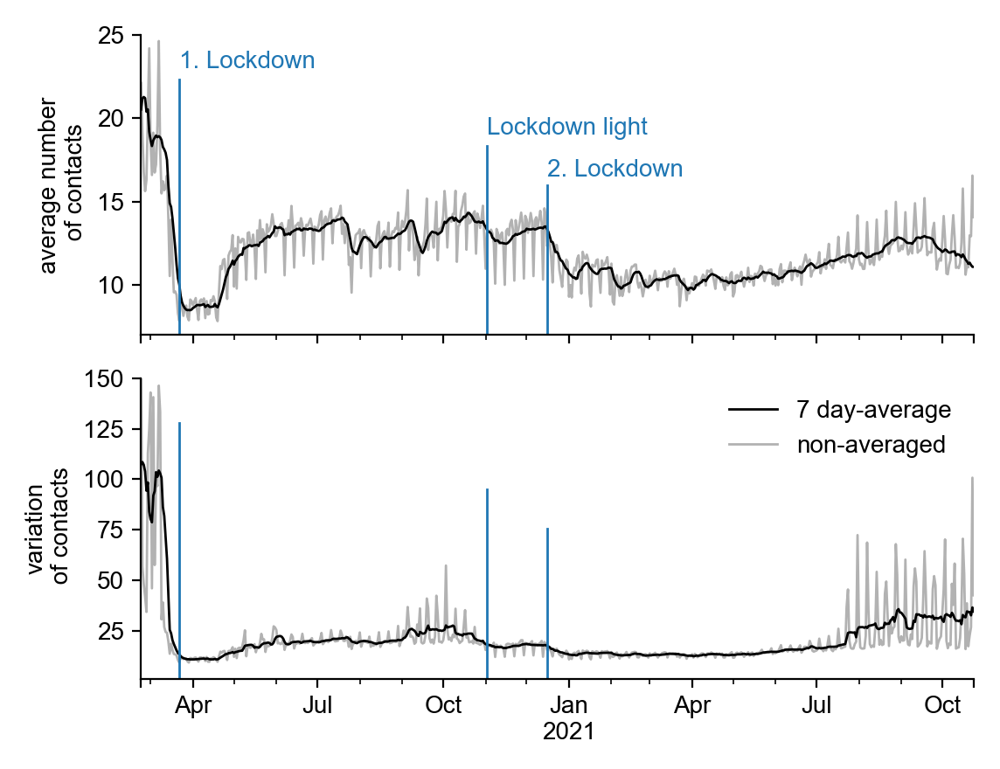
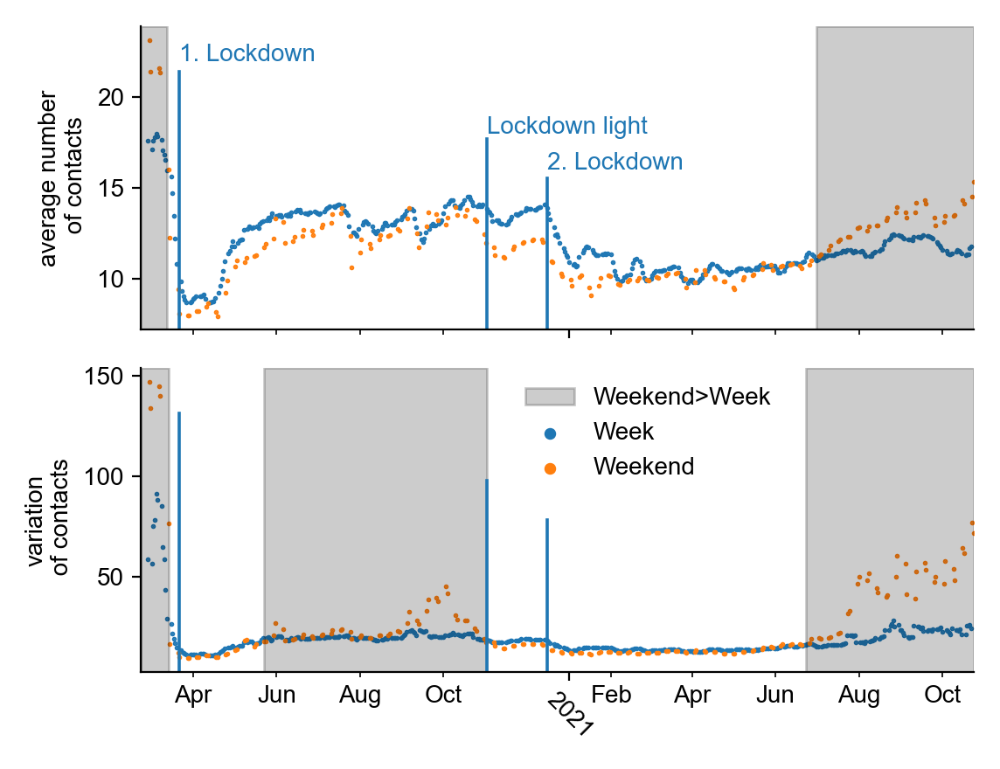

+++
date = "2021-11-03"
title = "Contact Behavior in the Pandemic"
slug = "contacts-pandemic"
draft = false
authors = ["pascal", "frank"]
+++

In the pandemic, we were often urged to reduce our contacts. After all, Covid-19 spreads primarily when people meet. We all know how we have restricted ourselves personally, in our own environment.

But how has contact behavior changed across the population? Our personal experiences are only snippets of the big picture, so it's instructive to look back and see an objective measure of our contact behavior.

We recently began displaying mean contacts and their variation in our [Contact Monitor]() (updated weekly). These values are based on the GPS data of about 600 000 cell phones per day, where a contact is counted as soon as 2 devices are at the same place at the same time (within a distance of about 8 meters). Only the anonymized statistics are available to us (see [Methodology]()).

## Contacts during the Pandemic

In the first lockdown (which fully took effect on 22.03.2020), we see a **sharp drop in the mean number of contacts, by about -50% compared to pre-pandemic levels** (from 19 to 9 contacts per person per day on average). The reduction in contacts already began before the hard lockdown, as individuals federal states in Germany decided on measures beforehand (e.g. school closures on 16.03.2020) and people reacted with contact restrictions on their own.





After the first lockdown, in the summer of 2020, contacts recovered but have never since returned to pre-pandemic levels.

After contacts recovered over the summer, the **lockdown light** (beginning on 02.11.2020) led to another dip, reducing the contacts to around **-30% below the pre-pandemic levels**. However, this reduction was much weaker than in the first lockdown, and after 2 weeks the numbers were already rising again.

It was not until the **second lockdown** (from 16.12.2020 on) that we saw a long-lasting reduction in our mean contacts to about 10 daily contacts until July 2021, which again corresponds to around **-50%** below pre-pandemic contact levels.

Recently (July to September 2021), we observed an upwards trend of slowly increasing contact levels. Currently, we observe a slight decrease in contacts, which could be due to the renewed increase in incidence or the seasonal changes.

## Variation of contacts and group size

Based on these observations, one might assume that lockdown light had only weak effects on our behavior. However, apart from the **mean number of contacts**, it is also important to look at the **variation** in contacts. The variation is greater the more people meet in **large groups**, which especially contribute to the spread.





If we look at the variation of contacts (first graphic), it is noticeable that there are **no longer any strong fluctuations in the variation of contacts** from lockdown light onwards. The spikes fall on the weekends, as large events take place there frequently, which drives up the variation of the contacts (see [Methodology]()).

Thus, the lockdown light has been **very effective in stopping larger events**.

## Contacts in Everyday Life and Leisure

Before the pandemic, we had on average **more contacts on weekends than during the week**. With the first lockdown, this relationship was reversed: during the lockdown, there are more contacts during the week than on weekends. This departure from the usual behavior lasted for over a year, until June 2021.

A possible explanation for this is that during the pandemic, our social life was reduced to **work and everyday contacts**, while **private contacts**, which we increasingly maintain on weekends, were consistently **reduced more strongly**.

**Since July 2021** however, we observe a steady **increase in contacts on weekends**, which are by now at higher levels than at any point during the pandemic. This could mean that people are increasingly taking up their regular leisure behavior at pre-pandemic levels.





Also, the **variation in contacts** (an indication of larger events) was higher on weekends before the pandemic, which reversed with the first lockdown. Since larger gatherings were the first to be reduced, this development is expected.

Here, it is noticeable that from the end of May 2020, the variation again became larger on weekends than during the week. However, the difference was small and did not increase until October 2020. It can be assumed that during this period, gatherings on weekends were again slightly larger, but significantly smaller than pre-pandemic large gatherings.

**After the lockdown light**, the variation in contacts was larger during the week than on weekends, suggesting that private weekend events were smaller than weekday (work-related) gatherings.

However, **since July 2021** we see a **dramatic increase in the contact variation** on weekends, similar to the increase in the average number of contacts. This indicates the people are meeting in larger groups on weekends again, at levels that are considerably greater than at other times during the pandemic.

## Conclusion

As our data shows, contact behavior is still permanently altered by the pandemic: People are meeting overall less and in smaller groups.

However, in the last months (since around July 2021) we observe an increase in contact levels, with a marked increase of contacts on weekends. This could indicate that people are meeting in their leisure time more often and in bigger groups than at any other time during the pandemic.

It will be exciting to see how contacts continue to evolve. The latest weekly figures can be seen in our [Contact Monitor]().
