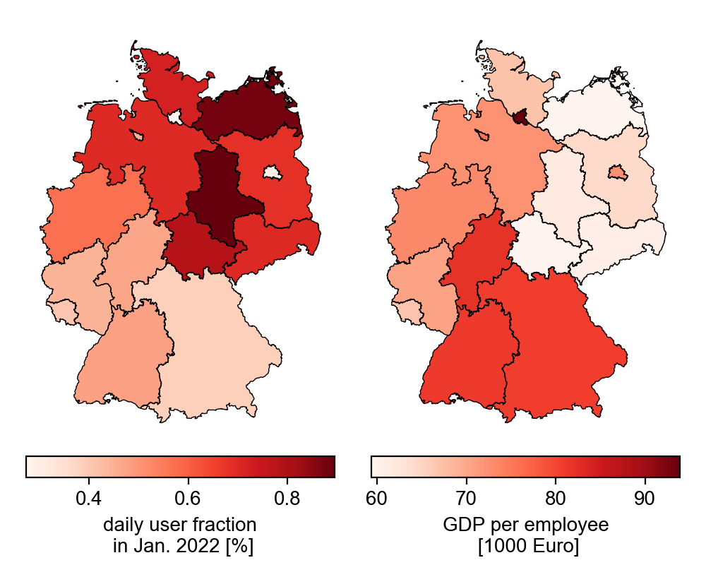

+++
date = "2022-03-14"
title = "Analysis for sampling bias in contact data"
slug = "contacts-sample_bias-mar2022"
draft = false
authors = ["pascal"]
+++

When collecting data, it can easily happen that certain groups of the population are overrepresented; the population sample is biased, so to speak. A well-known [example](https://www.nature.com/articles/550S18a) of this sampling bias comes from medical research, where new drugs are largely tested on men in clinical trials. One consequence is that a supposedly safe dosage of drugs triggers unforeseen side effects, especially in women.

The question now arises whether the group of users whose contacts are recorded (see [Methods]()) fairly represent the entire population. With a sample size of almost a percent of the population, the sample is very large compared with other studies, but it is far too small to rule out bias on the grounds of numbers alone.

## Differences in user numbers between countries as an indication

Since the **data is fully anonymized** (we only get the mean and standard deviation of daily contacts), it seems difficult to detect a bias at first glance. However, we additionally know the number of users in each federal state. Thus, we could for example say, that if federal states with a particularly high average age have higher user fractions, the sample underrepresents the younger segment of the population.
 
In the chart below, we can see that users in **Saxony-Anhalt and Mecklenburg-Western Pomerania represent the largest share of the population (about 0.9%)** compared to the other states.
In contrast, **Berlin and Hamburg cover about 0.3% of the population**. So, regions with **high population density** seem to have a low proportion of users.
There is also a north-south gradient, with an ever smaller proportion of the population being covered towards the south.
An opposite trend can be observed in the **gross domestic product per employee** (data from [eurostat](https://ec.europa.eu/eurostat/de/web/rural-development/data)), which could be an explanation.





## Density and income bias 

The lower plots illustrate the previous observations. If we plot the share of users against 
the gross domestic product per employee, we see that with a **higher average income, the share of users decreases**. 

Also the dependence on the population density becomes obvious: states with a **higher population density have a smaller share of users in the population**. Note that the x-axis is logarithmic: even a slight increase in population density leads to a sharp drop in the share of users. Change the scaling to linear in the below figure ("x-Log" -> "x-Linear") to make it clearer.    



Since areas with higher population density are associated with higher income, we could measure the same relationship twice here. However, it turns out (not shown) that **both measures explain the proportion of users independently**. 
Importantly, other measures, such as average age, are also related to population density. So there could be other biases not analyzed here.

We note these differences in the proportion of users **across states**, but it suggests that there is also sampling bias **within** states (and also in the nationwide contact measures): **Users from regions with lower density and/or income are likely to be overrepresented in each state's sample**.

So, in high-density states (e.g., Berlin and Hamburg), not only are the samples smaller and thus subject to higher uncertainty, but the samples are also less representative and thus should be considered with caution in the analyses. **The bias, of course, becomes especially a problem** when higher-income people from more densely populated areas have different contact behavior than lower-income people from rural areas.
