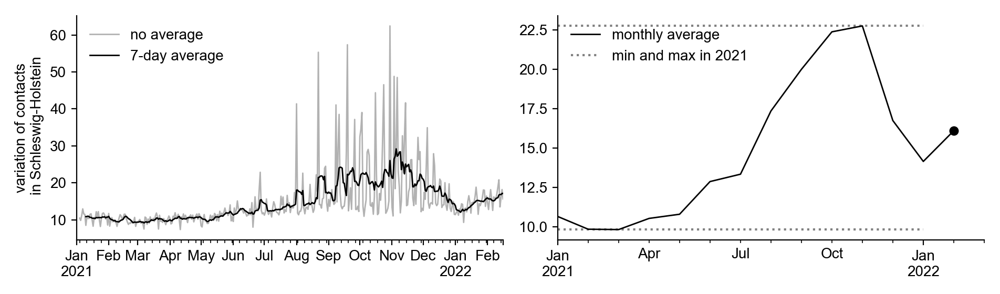

+++
date = "2022-03-01"
title = "Contact monitor update: now for federal states"
slug = "contacts-states-feb2022"
draft = false
authors = ["pascal"]
+++

As of today (01.03.2022), it is possible to observe the contact behavior for each federal state in our [contact-monitor](). The monitor is daily updated, although it takes a few days for enough user data to arrive to calculate the contact measures.
The mean number of contacts, as well as the variation of contacts (standard deviation) are calculated using the same methodology as the nationwide contact data: a contact between 2 devices is registered as soon as both are in the same place at the same time. Thereby, time is divided into 2 minute sections and space into 8 x 8 square meter tiles (see [methods]()). 

## Comparison of federal states by the relative variation of contacts

In a previous [report](), we have already investigated the contact behavior of the individual states. We found that the absolute values of the mean number of contacts and the variation in contacts depend strongly on the population density of each state. Thus, it should be noted that a direct comparison of the measures is only possible between states with similar population densities.

However, we can **make the contact measures comparable** if we consider them **relative to previous extremes**: For example, let's take Schleswig Holstein and their variation in contacts (an estimator of group sizes, see [methods]()). First, we can calculate the monthly mean to have less noise in the data. After finding the maximum and minimum monthly means in 2021, we can determine the most recent monthly mean (February 2022) relative to these extremes. For Schleswig-Holstein, it is about ½ (see figure below).





The **relative variations of contacts are read as follows**: If Berlin has a relative value of 1, the variation corresponds to the maximum in 2021. A relative value of 0.5 means that the current monthly mean is halfway between the minima and maxima of 2021. A relative value of 0 means that Berlins variation of contacts is as low as the minimum in 2021.

## Vaccination rate and contact behavior during the Omikron wave

Since Germany was hit by the Omicron wave in February 2022, with incidences never seen previously, a population sensitive to the infection events should avoid large group gatherings (reminder: the variation of contacts is an estimator for group sizes). In addition, a sensitive population should have a high vaccination rate (to contain the pandemic in general). Thus, we expect **countries with high vaccination rates to have low relative variation in contacts**.





Interestingly, city-states (highlighted in red) seem to have particularly high values compared to states with similar vaccination rates. However, if we consider the group of city states and the remaining states separately, **the expected dependence of the relative variation of contacts on the vaccination rate is confirmed**. The very high relative values in Berlin are likely partly caused by the Berlinale (Berlin International Film Festival), which takes place in February.

These findings suggest, that **the population in states with a higher vaccination rate reduce their contacts more in times of high incidence** (more specifically: the size of the group gatherings is smaller).

