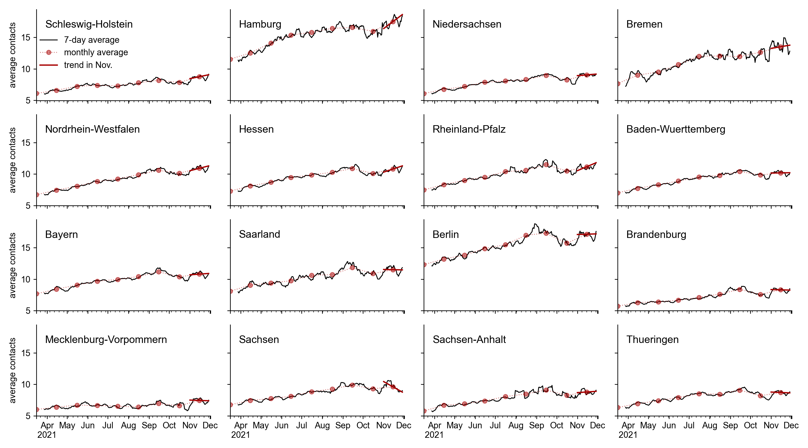
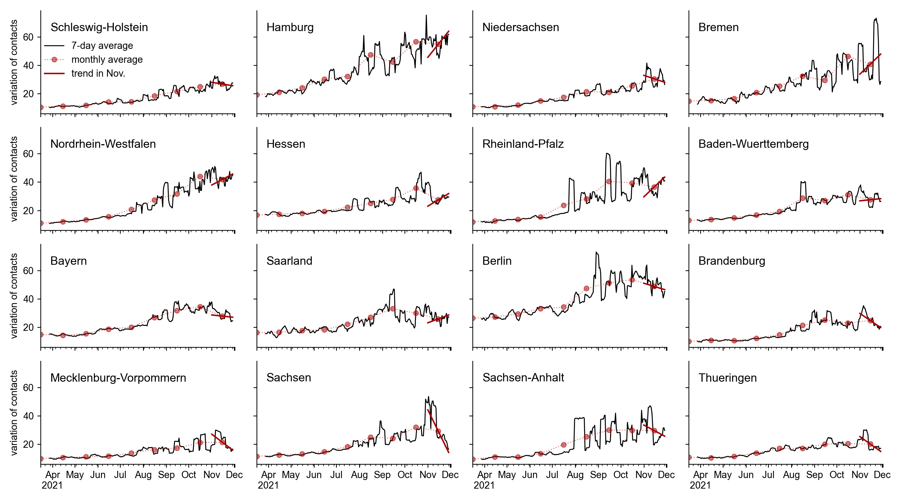
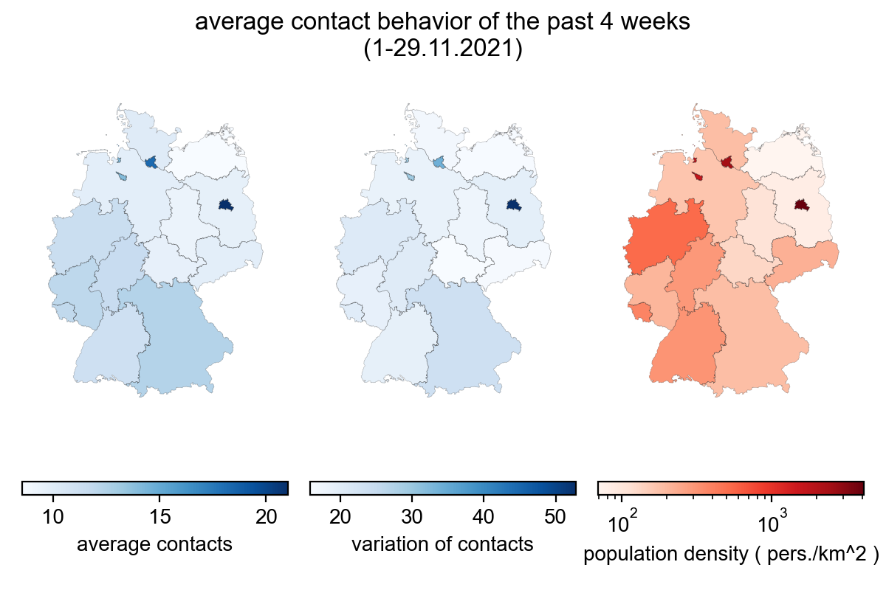
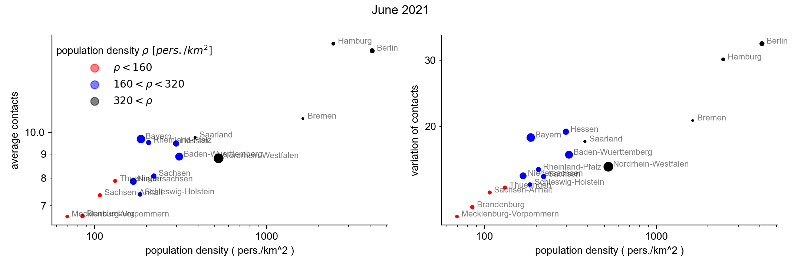
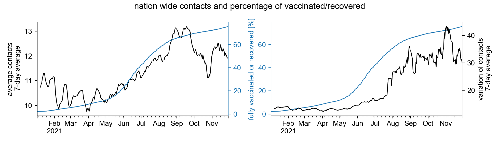
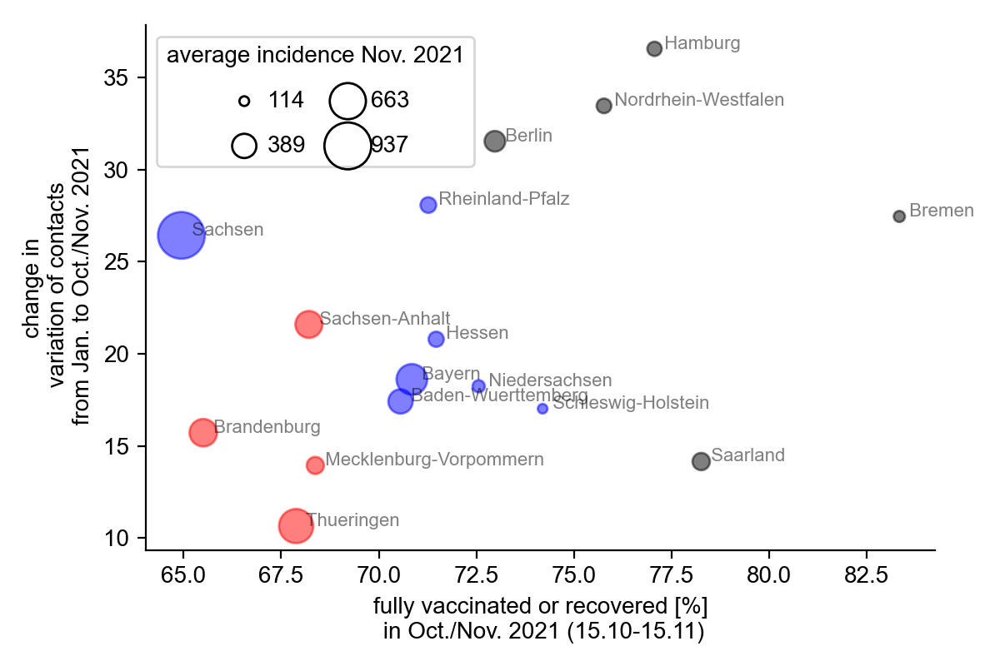

+++
date = "2021-12-09"
title = "Federal state resolved contact behavior"
slug = "contacts-states-nov2021"
draft = false
authors = ["pascal"]
+++

On our [contacts-monitor]() we can track the mean contacts and the variation of contacts at the federal level. Here we want to look at contact changes for each state. We focus on the most recent developments in the last month (November 2021), as a massive increase in the number of cases was recorded at that time.

In general, we observe a similar contact behavior as already known at the federal level: the **mean contacts** have been steadily increasing since April. In all federal states, mean contacts increased in November compared to October. **Within the month of November** (trend in November), mean contacts increased or stagnated in all federal states, with **exception of Saxony**, where there is a **clear downward trend**.





However, the **variation in contacts** is more important for the pandemic because it is an estimator of assembly sizes: if daily contacts vary greatly between individuals, it is mainly due to individuals with particularly large numbers of contacts, that are most likely reached during an event (see [methodology]()).

The states differ more in the variation of contacts. For example, compared to October the variation in November increased clearly only in **Schleswig-Holstein and Lower Saxony**; in most states it is comparable to October except in **Hesse, Bavaria, Saarland, Berlin, and Saxony where it falls significantly**.

**Within November** (trend in November) there is an increase in most of the old federal states (exceptions: Schleswig-Holstein, Lower Saxony, Bavaria). **In all new federal states, the variation of contacts falls in November**. Particularly noteworthy here is **Saxony with the strongest drop in variation of contacts**. The strong trend in Saxony and that Bavaria is an exception to the old states is probably due to the high incidence in these states and that politicians and individuals are reacting to it.





## Spatial distribution of contacts and the relationship with population density.

When we look at contact behavior over the past 4 weeks broken down by state, we see a north-south divide in both mean contacts and variation in contacts. This excludes the city states, which show the strongest contact behavior.  The city-states also have the highest population densities, and a direct comparison suggests that **more densely populated regions lead to more contacts and more variation in contacts**.





A contact between two cell phones is detected when they are about 8 meters apart at the same time (see methods). So this also registers **low-risk contacts** where pathogens cannot be transmitted if, for example, the contact occurs outdoors. **If the population density increases, low-risk contacts will be recorded more often**, but this should not affect the incidence.





We therefore divide the states into 3 groups: one with low population density (less than 160 persons per km^2 ), medium (between 160 and 320 persons per km^2 ) and one with high population density (more than 320 persons per km^2) which we will color-code with red, blue and black in the following. A comparison of the states within each group is thus fairer.

## The change in contacts and the fraction of vaccinated or recovered

Since the beginning of 2021, increasing numbers of people have been vaccinated. Thus, the proportion of the population for whom the likelihood of contracting Covid-19 increased by about 70% and the likelihood of transmitting the disease decreased by about 50%. The situation is similar for recovered, which is why contacts carry less risk for both groups.

Thus, we observe that with a higher proportion of vaccinated or recovered, the mean number of contacts also increases. Similar holds for the variation of contacts, but its increase becomes stronger from 50% vaccinated/recovered. Since the variation in contacts is an approximation for group sizes, **assemblies appear to increase more with the proportion of vaccinated/recovered when the proportion of vaccinated/recovered dominates**.

It should be noted here that the change in contacts is not only due to the increase in the proportion vaccinated and recovered. In general, we can expect to slowly rebuild more contacts over time and get closer to the pre-pandemic "normal" state.                                                                                                                                                                                                                                    




# The influence of vaccination rate and contact behavior on incidence.

For the incidence of infection, the variation of contacts is crucial, which could be shown in the study of [Ruediger et al.](https://www.pnas.org/content/118/31/e2026731118) with the contact index, which is very strongly related to the variation of contacts (the study is based on the same data). It could be shown that the momentaneous contact index describes the infection occurrence in about 2 weeks. Thus, the mean variation in contacts from mid-October to mid-November should describe the incidence in November 2021. However, the proportion vaccinated/vaccinated is also important, and we expect states with a higher proportion to have lower incidence.





If we look at these 3 aspects (contacts, vaccination/gene proportion, incidence) together and compare the states with similar population density with each other (same colors), we notice that in **Saxony the variation of contacts has increased a lot** since January, but compared to the other states of similar population density **has the lowest proportion of vaccinated/gene**. This may well explain why Saxony has the highest mean incidence of any state in November 2021.

It is also noticeable that the **states with the lowest population density also have the lowest proportion of vaccinated/recovered** (with the exception of Saxony), and those with the highest population density have the highest proportion. It could be that people in more densely populated regions have to be more considerate of each other in everyday life, and thus the insight that one also protects others through one's own vaccination is more readily available.

One last point remains to be mentioned in this graph: The new German states have the lowest proportion of vaccinated/recovered in their respective population groups, i.e., Berlin in the densely populated group and Saxony in the middle group. The group with the lowest population density consists exclusively of new federal states.
