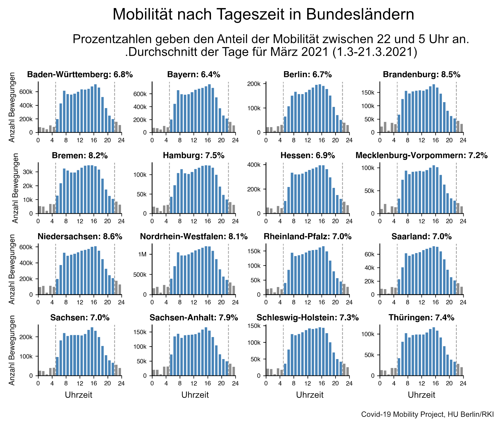

+++
date = "2021-03-31"
title = 'Possible Effects of Curfews on Mobility'
slug = "mobility-curfew"
draft = false
authors = ["frank"]
+++

The following chart shows the average mobility in Germany over the course of one day. It can be used to estimate which portion of mobility could be affected by a possible curfew.

All movements within districts in Germany (local mobility) are recorded. For each hour, the average number of movements that started in that hour is given. The number is averaged over the first three weeks of March 2021 (1.3-21.3.2021).





It can be seen that a **relatively small proportion of mobility (7.4%)** falls within the period from 10:00 pm to 5:00 am, which is often discussed for the application of a curfew.

If the time period is **extended** to, say, 8:00 p.m. to 5:00 a.m. **the affected share of mobility increases slightly to 12.3%**.

It should be noted that a curfew does not eliminate 100% of the movements during the period of the curfew. In addition, there are likely to be reactions in behavior that counteract the effects of a curfew, for example by people shifting individual trips to the period outside the curfew.

## Federal states in comparison

We have also carried out the same analysis separately for the individual federal states. Overall, we see few deviations from the Germany-wide average in the states. The daily mobility curve is similar in all states.

The proportion of mobility that falls within the period of a possible curfew is just as similar; it ranges from 6.4% in Bavaria to 8.6% in Lower Saxony.





## Comparison with the first lockdown

Compared to the previous year, the 7-day average daily mobility is currently about -11% below the 2019 level (as of 03/26/2021). This is a much smaller decrease than in the first lockdown, when mobility dropped to as much as -40% below the previous year's level.



## Hourly comparison

But what does this look like in the hourly resolution? The chart below shows the difference in the hourly number of movements compared to 2019. You can see that mobility at the peak of the first lockdown in March 2020 was significantly lower than in March 2021, especially in the middle of the day.




