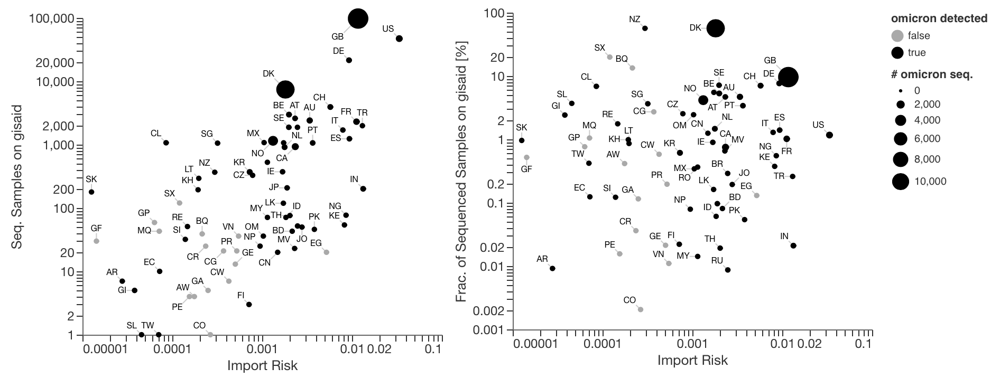
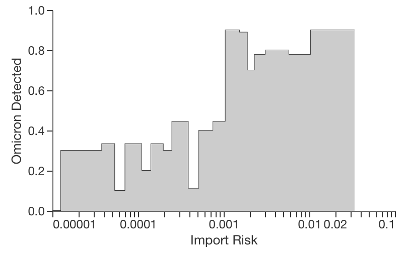
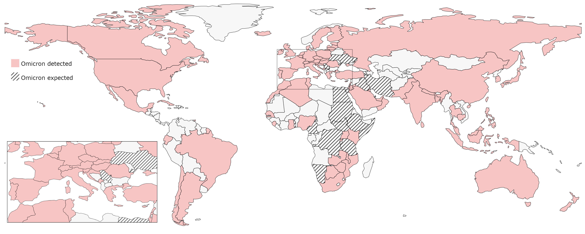
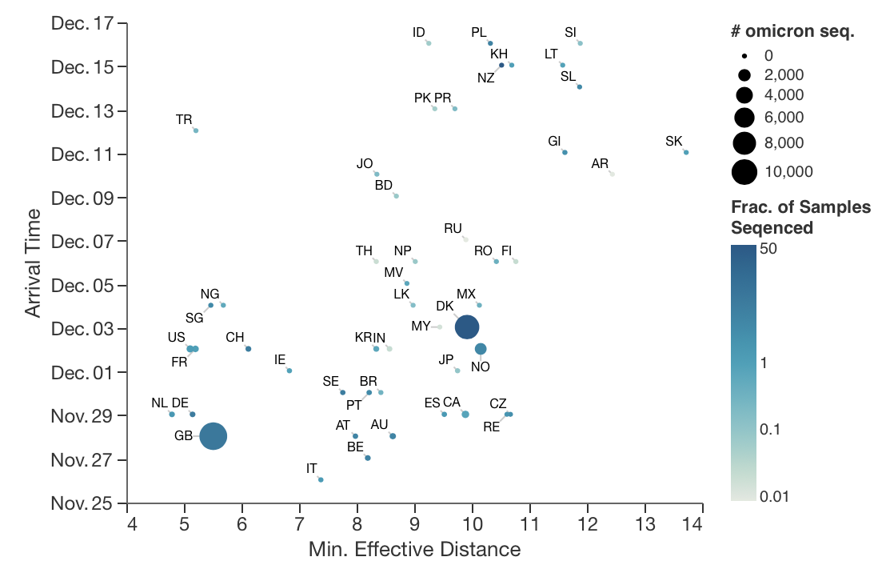

+++
title = "Update: Omicron - Import Risk (potentially affected Countries)"
slug = "importrisk_omicron_update"
date = "2021-12-17"
authors = ["adrian", "pascal"]
+++

Here, we update and extend a recent [report]() from 29.11.2021 with new data. At the time the first omicron report was written, omicron was detected in only 11 countries. Today (17.12.2021) **omicron was confirmed in 92 countries** (according to [omicron-tracker at newsnodes](https://newsnodes.com/omicron_tracker)).

Originally, we used the world aviation network to compute the shortest path from the airports from South Africa and Botswana to all other airports. Based on these shortest paths, we computed the import risk of omicron for each country. Thereby, we consider that passenger can also use connecting flights. Thus, not only countries with direct flight connections are at risk (for more details see [Import Risk methods]()).

Next to the import risk, **depends the detection of omicron** on the **number of sequenced positive tests** or the fraction thereof: The more you are looking for it, the more likely you find it. We see a positive relation between the import risk and the number of sequenced samples, which could be explained by the size and the wealth of the country: the number of passengers traveling to a specific country (as South Africa or Botswana) is larger the wealthier and larger the originating country.





The fraction of sequenced samples uploaded to [GISAID](https://www.gisaid.org/) of all positive tests in the respective country, is the **probability to sequence a positive sample**. The countries with a high import risk and a relatively large fraction of sequenced samples (>0.2%) have already detected omicron in their population. It suggests that omicron is already in countries with a comparable import risk, but was not detected yet.

## Countries with omicron but without reports

If we group countries with comparable import risk in groups of about 10 and compute the **fraction of countries that already detected omicron**, we see a sharp transition at an import risk of about 0.001. This strengthens the point that omicron is already in countries with an equal or larger import risk than 0.001. Note that only those countries are in the scatter plots who uploaded sequenced data to GISAID in November 2021, i.e. the plot below contains more countries.





In the following map, we highlight the 17 countries without omicron reports but an import risk larger than 0.001 (omicron expected) and the countries with confirmed omicron cases (omicron detected). 11 of the countries where we expect omicron are in Africa, 4 in the near east (double counting Egypt), 2 in Europe and the Dominican Republic.





## Omicrons arrival time

Lastly, we show that the **arrival time of omicron** correlates with the **minimal effective distance** (the shortest effective distance (see [Import Risk methods]()) between any airport of a specific country and any airport of the outbreak countries). Interestingly, the correlation worsens if we use the inverse of the import risk (not shown). However, the arrival time is stochastic and depends on how strong the respective country is sampling and when the sequences were uploaded to GISAID. Thus, there is a fair degree of uncertainty.




